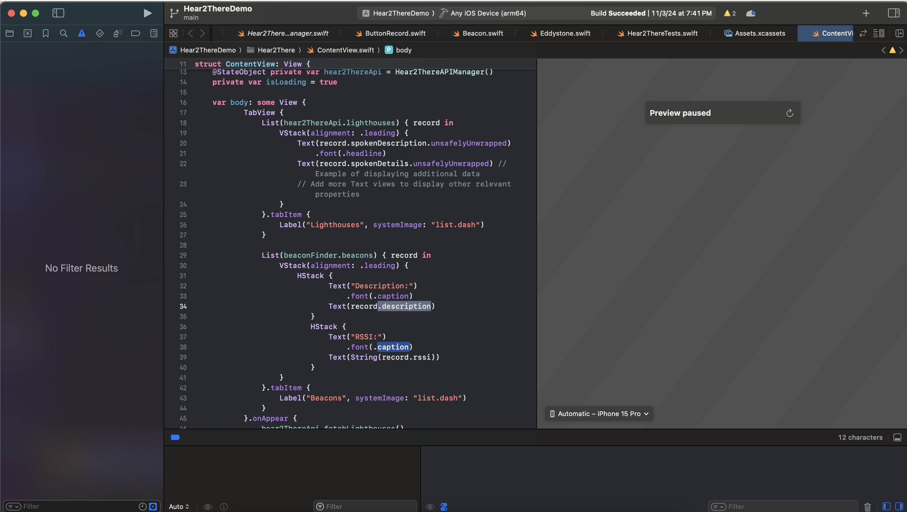
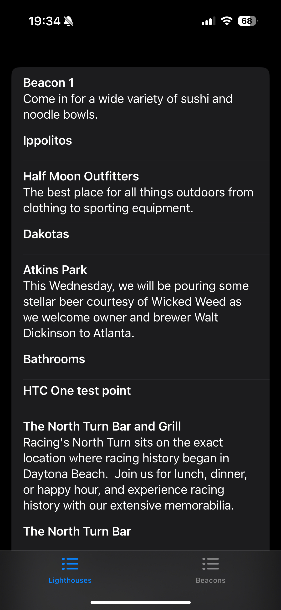

## Hear2There SDK Demo

This documentation exists to provide an introduction into the Hear2There SDK demonstration, including detecting local beacons and our API surface. 


## Hear2There Beacons
This library is designed to interact with Foresight AR's Hear2There beacons. Hear2There Beacons implement the Eddystone protocol.


Eddystone beacons are small, wireless transmitters that use Bluetooth Low Energy (BLE) technology to broadcast signals to nearby devices, such as smartphones and tablets. These beacons emit a unique identifier that can be used to trigger specific actions on the receiving device, like opening a webpage, displaying a notification, or providing location-based information. Unlike traditional Bluetooth connections, Eddystone beacons don't require pairing with the device and can operate on a coin cell battery for several years. They are commonly used for proximity marketing, indoor navigation, asset tracking, and various Internet of Things (IoT) applications.


This demo library provides functionality to:

1) Detect Local beacons nearby
2) Provide real time ranging of those beacons by measuring the RSSI (Received Signal Strength Indicator)
3) Interact with the Foresight Hear2There remote API, by listing Beacons in our database along with relevent Geotagging information
4) Provide a basic UI rendering of those features for testing purposes.


## Asside: Xcode Signing
Xcode code signing for development is the process of digitally signing your app with a development certificate issued by Apple. This allows you to install and run your app on your own devices or devices registered on your Apple Developer account for testing purposes.  During the development process, Xcode uses your signing identity (which includes your development certificate and private key) to create a signature for your app. This signature verifies the app's authenticity and integrity, ensuring that it hasn't been tampered with.  Code signing is a crucial step in iOS app development as it's required to run your app on physical devices and distribute it through the App Store.

If you need a development signing cert you can enroll in the Developer Program [Here](https://developer.apple.com/programs/enroll/)


## Building 
The Demo application can be built with Xcode by pressing the play button. Developing in the simulator *may* work but is currently untested. Deploying to your iOS device will make it easier to measure changes in RSSI as you walk around your beacons.




## Running
Once the Demo application is running you can view API results and RSSI strength of nearby beacons by toggling the tab menu




## Code Overview
There are three projects of interest in the demo appliaction:

* EddystoneSDK, the underlying library for interacting with nearby Eddystones. Required for detecting Hear2There beacons.
* Hear2ThereSDK, our library for interacting with Foresight Beacons and the Foresight API.
* Hear2There: A Demo swift UI application that can read from the remote API and dynamically detect and measure RSSI of nearby beacons.


## Hear2There SDK
The SDK itself provides two classes of interest:
1) Hear2ThereAPIManager: A class that can fetch the list of beacons in our database
2) BeaconFinder: A class responsible for maintaining a list of nearby beacons and updating their RSSI.

BeaconFinder will keep an Eddystone in it's collection until it hasn't recieved a BLE update from the device for a short timeout period (about 30 seconds)


## Using The Beacon Finder Class
A Beacon Finder can be class instantiated on a SwiftUI View and will automatically start searching for nearby beacons

```swift
struct ContentView: View {
    @StateObject var beaconFinder = BeaconFinder()
    ....
}
```

As nearby beacons are detected they are added to the `beaconFinder.beacons` collection. Since `BeaconFinder` implements `ObservableObject` any UI that relies on it will automatically update when new beacons are detected or RSSI changes:

```swift
List(beaconFinder.beacons) { record in
    VStack(alignment: .leading) {
        HStack {
                Text("Description:")
                    .font(.caption)
                Text(record.description)
            }
            HStack {
                Text("RSSI:")
                    .font(.caption)
                Text(String(record.rssi))
            }
    }
}
```

## Using The API manager class. 
An ApiManager can be class instantiated on a SwiftUI View and be used to make requests against our API. 

```swift
struct ContentView: View {
    @StateObject private var hear2ThereApi = Hear2ThereAPIManager()
    ....
}
```

Currently we only support fetching all avaiable beacons. More API functionality will be implemented later.


Fetching Lighthouses can be triggered when your UI code is ready to load from the remote server:

```swift
var body: some View {
    TabView {
        List(hear2ThereApi.lighthouses) { record in
            VStack(alignment: .leading) {
                Text(record.spokenDescription.unsafelyUnwrapped)
                    .font(.headline)
                Text(record.spokenDetails.unsafelyUnwrapped)
            }
        }
    }.onAppear {
        // API triggered here when our view is visible
        hear2ThereApi.fetchLighthouses()
    }
}
```
