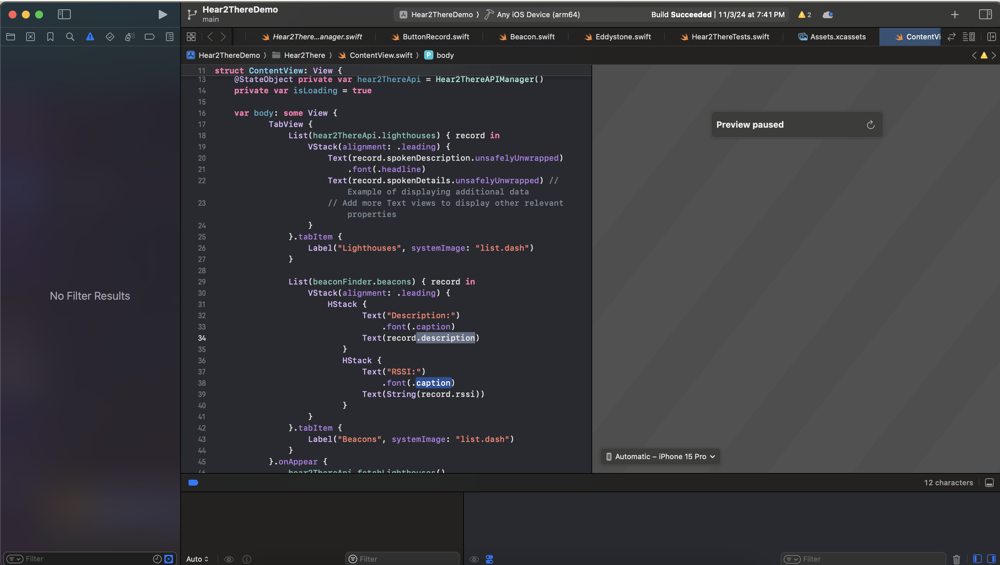
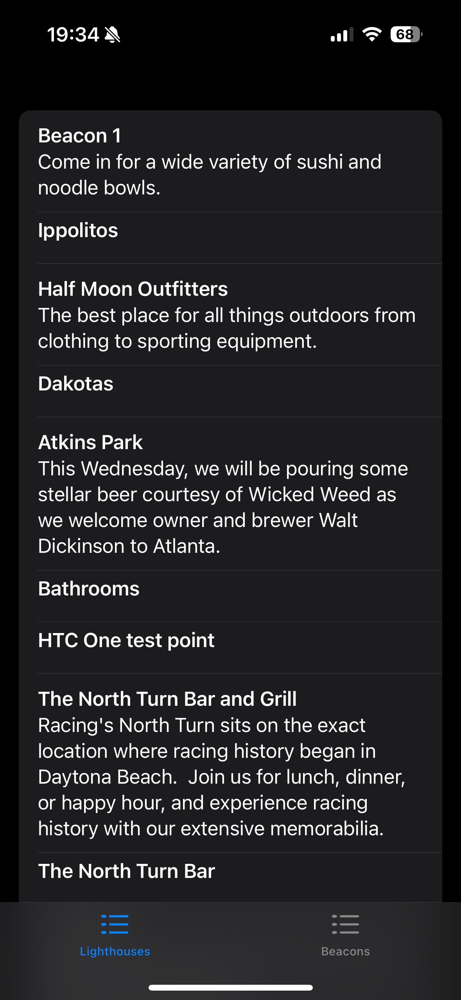

# Development

## Asside: Xcode Signing
Xcode code signing for development is the process of digitally signing your app with a development certificate issued by Apple. This allows you to install and run your app on your own devices or devices registered on your Apple Developer account for testing purposes.  During the development process, Xcode uses your signing identity (which includes your development certificate and private key) to create a signature for your app. This signature verifies the app's authenticity and integrity, ensuring that it hasn't been tampered with.  Code signing is a crucial step in iOS app development as it's required to run your app on physical devices and distribute it through the App Store.

If you need a development signing cert you can enroll in the Developer Program [Here](https://developer.apple.com/programs/enroll/)


## Building 
The Demo application can be built with Xcode by pressing the play button. Developing in the simulator *may* work but is currently untested. Deploying to your iOS device will make it easier to measure changes in RSSI as you walk around your beacons.




## Running
Once the Demo application is running you can view API results and RSSI strength of nearby beacons by toggling the tab menu




## Code Overview
There are three projects of interest in the demo appliaction:

* EddystoneSDK, the underlying library for interacting with nearby Eddystones. Required for detecting Hear2There beacons.
* Hear2ThereSDK, our library for interacting with Foresight Beacons and the Foresight API.
* Hear2There: A Demo swift UI application that can read from the remote API and dynamically detect and measure RSSI of nearby beacons.


## Bundling
You can Bundle Hear2There SDK by running the bundle script

```sh
./bundle.sh
```
Or by running the commands manually
```
xcodebuild archive \
    -project Hear2There.xcodeproj \
    -scheme Hear2ThereSDK \
    -destination "generic/platform=iOS" \
    -archivePath "archives/Hear2ThereSDK-iOS"

xcodebuild archive \
    -project Hear2There.xcodeproj \
    -scheme Hear2ThereSDK \
    -destination "generic/platform=iOS Simulator" \
    -archivePath "archives/Hear2ThereSDK-iOS_Simulator"

xcodebuild -create-xcframework \
-archive archives/Hear2ThereSDK-iOS.xcarchive -framework Hear2ThereSDK.framework \
-archive archives/Hear2ThereSDK-iOS_Simulator.xcarchive -framework Hear2ThereSDK.framework \
-output xcframeworks/Hear2ThereSDK.xcframework
```
